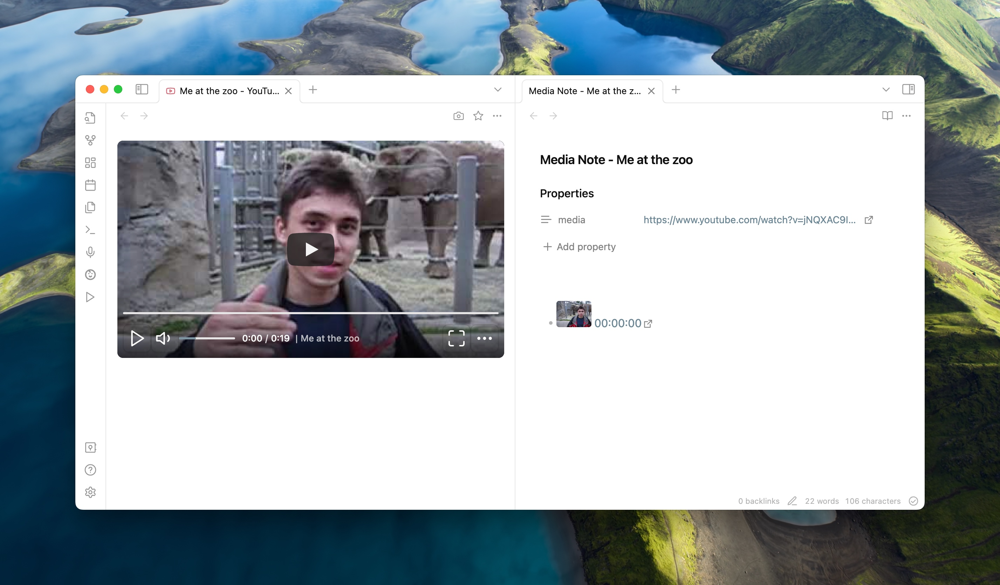

# Media Extended Mobile

Media Extended 的可维护移动端分支，基于上游最后一个 MIT 开源版本 v3.2.6。

插件 ID 为 `media-extended-mobile`，显示名为 **Media Extended Mobile**，可与原版 Media Extended 同时安装。



本分支不修改或重新发布闭源的 Media Extended v4 产物。它保留 v3 的视频笔记、时间戳、字幕和本地媒体功能，并逐步替换移动端不存在的 Node.js/Electron API。

## 当前移动端状态

- 插件清单已允许 Obsidian Mobile 正常安装，无需 BRAT 的“不兼容插件”开关。
- 模块初始化不再在移动端加载 Node `path`/`url` API。
- YouTube 在移动端使用官方隐私增强 iframe 播放器；设备网络仍需能够访问 YouTube。
- 哔哩哔哩 BV、av、ep、ss 完整链接在移动端使用官方嵌入播放器；支持分 P 和链接中的起始时间。Android 8 及更早版本的普通 BV/av 链接会回退到旧版官方移动播放器。
- Vimeo 继续使用 iframe 播放器。
- 本地仓库媒体继续使用 Obsidian 的资源 URL 播放。

### 已知限制

- YouTube 与哔哩哔哩移动端 iframe 暂不接入 Media Extended 的播放控制和自动时间戳读取。
- iframe 视频画面受浏览器同源策略保护。Android/iOS 上可先聚焦目标笔记，再切到视频完成系统截图并点击新增的“导入并裁剪系统截图”按钮；默认勾选“选择图片后自动导入”，选好截图后会立即裁剪播放器区域并插入此前聚焦的笔记，不会新建媒体笔记。原有相机截图按钮保持不变。
- Android 是否直接显示系统相册由 Obsidian WebView 和系统版本决定；Android 8 或部分 ROM 可能显示文件窗口，此时从“图片”或“最近”中选择截图。
- B 站短链 `b23.tv` 需要先展开成完整链接。
- 桌面端继续使用原有 Electron 网页播放器能力。

## 安装

BRAT 1.1.0 及以上版本从 GitHub Release 安装插件。把本仓库地址加入 BRAT，选择最新的 `*-mobile.*` 预发布版本即可。Release 必须包含 `main.js`、`manifest.json` 和 `styles.css`。

测试链接：

```text
obsidian://mx-open/https://www.youtube.com/watch?v=jNQXAC9IVRw
obsidian://mx-open/https://www.bilibili.com/video/BV1xx411c7mD
```

## 开发与发布

```bash
corepack pnpm@9.15.9 install --frozen-lockfile
pnpm type-check
pnpm build:plugin
pnpm prepare:release
```

推送与 `manifest.json` 版本一致的 `*-mobile.*` 标签后，GitHub Actions 会构建并创建 BRAT 可识别的预发布版本。

## Features 🌟

- **Seamless Integration with Obsidian** 🤝: Works perfectly with Obsidian's live preview and multi-window support, ensuring a smooth workflow.
- **Embed Multimedia Files** 📁: Easily embed both local or hosted video and audio files directly into your notes, bringing your content to life.
- **Playback Control** ⏯️: Utilize commands and keyboard shortcuts for efficient playback control, including play, pause, skip, and timestamping for quick references.
- **Support for Multiple Video Platforms** 🌐: Enjoy support for popular platforms like YouTube, Vimeo, Coursera, Bilibili, and more. If it can be played in a web browser, it can be embedded in your notes.
- **Local Subtitle Support** 📑: Enhance your media with local subtitle files in SRT, VTT, and ASS formats, making it easier to follow along or understand content in another language.
- **Media Fragments** 🎞️: Create media fragments that play only within a specified range, perfect for focusing on specific parts of a lecture or presentation.
- **Playlist Support** 📋: Organize your media files into playlists for continuous playback.

## 后续计划

- [x] **Mobile installation and basic playback** 📱
- [ ] **Bilibili playback state and timestamp bridge**
- [x] **Android/iOS system screenshot import and automatic player-area cropping**
- [ ] **A direct mobile screenshot bridge, if Obsidian exposes a supported API**
- [ ] **Metadata and Subtitle Extraction** 📊: Pull metadata and subtitles directly from YouTube and Bilibili.

- [ ] **Canvas Support** 🎨: Get creative with how you integrate and display media within your notes.
- [ ] (Paid Features) **AI Summary for Transcript** 🤖: Get concise summaries of your media's content.
- [ ] (Paid Features) **Table/Text OCR for Screenshots** 📷: Extract text from images for easy reference and integration.
- [ ] (Paid Features) **Transcript Generation from Video** 📝: Automatically generate text transcripts from your video content.

## Special Thanks

A special thanks to [bfcs](https://github.com/bfcs) for their valuable contributions. They have helped fix issues during a long period of inactivity and made attempts to implement YouTube transcript functionality!
